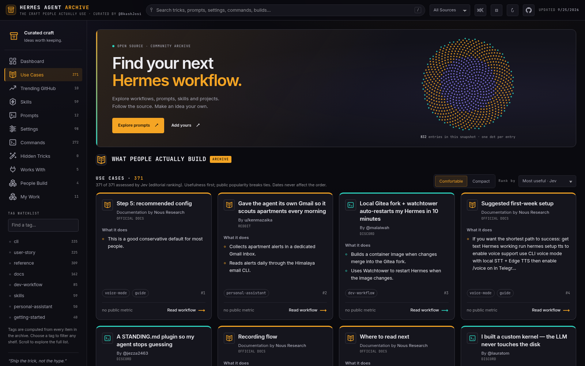
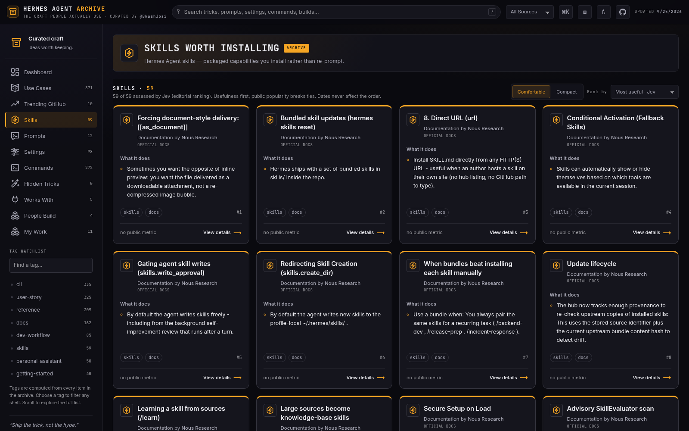
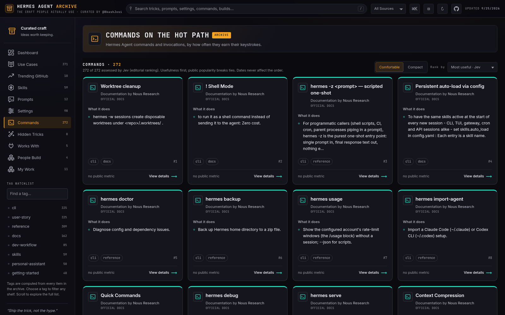
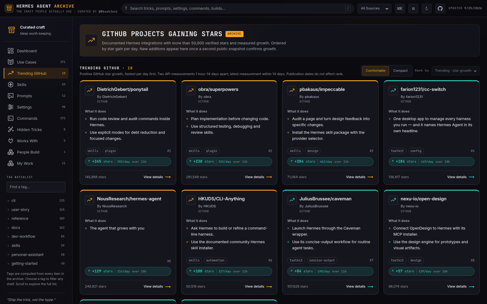
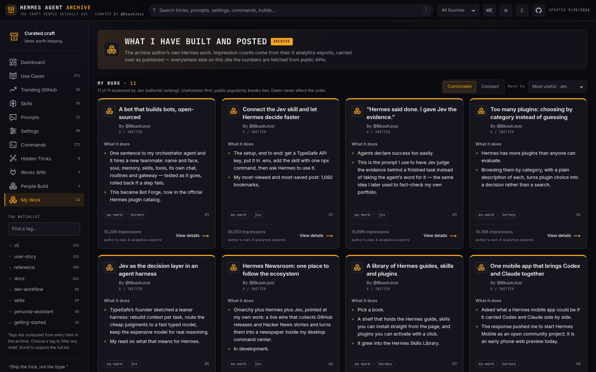

# Hermes Agent Archive

[](https://github.com/BkashJEE/hermes-agent-archive/actions/workflows/validate.yml)
[](LICENSE)
[](https://hermes-agent-archive.vercel.app)
[](CONTRIBUTING.md)

An independent community archive of Hermes Agent workflows, prompts, skills and projects. Entries link to their sources and credit their authors. Original site code is MIT licensed; third-party content retains its source rights. This is not an official Nous Research product.

[Browse the archive](https://hermes-agent-archive.vercel.app) · [Contribute](CONTRIBUTING.md) · [Methodology](docs/METHODOLOGY.md) · [Release readiness](docs/RELEASE_READINESS.md)

The archive is under active development. Some shelves are incomplete, and importer coverage is still being finished. A source link is not proof that a workflow works, and a listing is not a security endorsement.

## Run your own copy

Install Git and Node.js 20 or newer, then:

```bash
git clone https://github.com/BkashJEE/hermes-agent-archive.git
cd hermes-agent-archive
npm start
```

Open **http://127.0.0.1:4179**. No `npm install`, build, API key, account or Vercel access is needed to browse the included data. The dependency-free preview server binds to your machine's loopback interface, serves public assets only, and disables caching. Opening `index.html` as a file will not work because the page fetches JSON.

```bash
npm run check   # validate archive data: fields, duplicate IDs and titles, source links, credits
npm test        # rendering, ranking, parsing, data and local-server regression tests
npm run links   # confirm every source link and documentation anchor still resolves
npm run prompts # re-verify every stored prompt against the page it cites
```

The last two reach the network, so they are not part of the required checks.

Use a recent browser with JavaScript enabled. Inter and JetBrains Mono load from Google Fonts; fallback fonts work when offline. Search and preferences work locally. Changes to your clone cannot change the shared website. `private: true` in package.json prevents accidental npm publication; it does not make the source repository private.

## What is here

- Community stories preserve source quotations, authors and permalinks.
- Documentation and prompt examples link to the relevant upstream pages.
- Repository cards require **strictly more than 50,000 public GitHub stars** and reviewed upstream documentation of Hermes support.
- Trending shows positive star growth measured between two public API observations, not GitHub's own Trending feed.
- My Work contains the maintainer's posts with explicitly credited analytics, separate from public-popularity evidence.

The star cutoff is an editorial preference. It excludes smaller and newer projects and does not prove quality, safety or Hermes relevance. Jev's usefulness labels are automated editorial assessments, not votes or independently verified results. Missing metrics remain unknown. Read the [methodology and limitations](docs/METHODOLOGY.md) before interpreting the rankings.

## The shelves

| Shelf | Holds | Now |
| --- | --- | --- |
| **Dashboard** | Counted live from what is loaded, never stored or estimated. | computed |
| **Use Cases** | Real user stories, each quoted and linked to the original post. | 372 |
| **Trending GitHub** | Documented integrations with measured star growth per day. | computed |
| **Skills** | Packaged capabilities you install rather than re-prompt. | 59 |
| **Prompts** | Copyable examples, each verified against the page it cites. | 12 |
| **Settings** | Configuration that materially changes how a run behaves. | 98 |
| **Commands** | Commands and invocations, by how often they earn their keystrokes. | 272 |
| **Hidden Tricks** | Non-obvious moves most people never find. | 0 |
| **Works With** | Repositories worth pairing with Hermes, each read before listing. | 8 |
| **People Build** | Projects built on Hermes and shown off publicly. | 4 |
| **My Work** | The maintainer's own posts, with analytics explicitly credited. | 11 |

Hidden Tricks is empty on purpose rather than by neglect. Claiming something is a
non-obvious trick asserts that it is absent from the documentation, which no classifier
can establish, so that shelf and Prompts are filled only by reviewed extraction. The
router refuses to place anything there, in code.



<details>
<summary><b>More shelves</b></summary>

### Skills


### Commands


### Dashboard


### Trending GitHub


### My Work


</details>

## Contribute or correct something

[Suggest an entry](https://github.com/BkashJEE/hermes-agent-archive/issues/new?template=submit-entry.yml), [report a correction](https://github.com/BkashJEE/hermes-agent-archive/issues/new?template=correction.yml), or fork the repository and open a pull request.

Include the original source, author, practical details and limitations. Disclose a connection to a recommended project. Criticism of the archive's claims and selection rules is welcome. See [CONTRIBUTING.md](CONTRIBUTING.md) and the [code of conduct](CODE_OF_CONDUCT.md).

Submissions are proposals. BkashJEE decides what merges and publishes to the shared site. Contributions grant no repository write access or Vercel account access. Independent use of the MIT-licensed code does not require approval from this project's maintainer.

## Sources, rights and privacy

The [MIT license](LICENSE) applies to original site code and original project documentation. It does **not** relicense the whole JSON dataset, third-party quotations, project branding or screenshots of third-party material. Retain [source notices and credits](NOTICE.md) and check source-specific rights before republishing content elsewhere.

The application has no visitor accounts or analytics tracker. It stores display preferences locally and requests fonts from Google; hosting providers also receive network requests. See [privacy and data handling](docs/PRIVACY.md). Report vulnerabilities privately using [SECURITY.md](SECURITY.md).

## Optional maintenance

Browsing, editing and tests do not need credentials. Public-source refreshes and Jev classification are separate maintainer tasks and require network access. Never paste credentials into an issue or PR.

```bash
npm run key       # write optional credentials to gitignored .env with mode 600
npm run fetch     # refresh public API snapshots
npm run route     # route candidates with Jev, or keyword rules when unavailable
npm run rank      # classify archive entries; requires TYPESAFE_API_KEY
npm run check
npm test
```

`GITHUB_TOKEN` supports authenticated GitHub requests. Reddit fetching uses `REDDIT_CLIENT_ID` and `REDDIT_CLIENT_SECRET`; refreshes may fail without them. `TYPESAFE_API_KEY` enables Jev. Configured shell variables take precedence over `.env`. Never use source-refresh jobs as a deployment trigger.

`MIN_STARS`, `MIN_HN_POINTS`, `MIN_REDDIT_UPVOTES` and `MAX_PER_SECTION` configure sourcing. The hosted default remains more than 50,000 GitHub stars; the shared policy module accepts explicit non-negative integer overrides in either direction. Fetches record the effective cutoff so routing, rendering and Trending agree. Use `npm run fetch -- --github-only` to refresh GitHub separately. Existing stored records are retained when excluded from display. Failed runs must preserve the previous data and exit nonzero.

Existing import commands:

```bash
npm run docs                            # official documentation, per scripts/docs-manifest.json
npm run docs -- --dry                   # report what would land, write nothing
node scripts/import-hermes-stories.mjs  # Nous Research's community stories
node scripts/import-hermes-cli.mjs      # official CLI reference
node scripts/import-jev-hermes.mjs      # Hermes entries in the Jev directory
```

Sources change, and not every shelf is reproducible from an importer: Hidden Tricks has no extractor yet, and the Skills Hub and Plugins pages are client-rendered with no public JSON behind them, so neither can be imported honestly. `scripts/docs-manifest.json` records every documentation page that is imported, and every page that is not, with the reason. Do not overwrite a failed import with an empty result. Remaining coverage is tracked in [release readiness](docs/RELEASE_READINESS.md).

Maintenance can incur external API usage under the account where it runs. No credentials or scheduled jobs are inherited by cloning or forking. Ranking results may change when evidence or the classifier changes. Stale classifications should be shown as unclassified, never silently reused as current.

## Project layout

```text
index.html                 static page
assets/css/                palette tokens and styles
assets/js/                 plain browser ES modules
assets/licenses/           retained upstream notices
data/index.json            shelf configuration; computed shelves have no file
data/*.json                curated entries and generated API/ranking snapshots
scripts/                   local server, importers, maintenance and validation
docs/                      methodology, privacy and release status
```

Keep the project vanilla HTML/CSS/JavaScript: no application dependencies, framework or build step. Follow [AGENTS.md](AGENTS.md) for data integrity, source attribution and accessibility requirements.

## Publishing

Only the maintainer publishes the canonical [Vercel site](https://hermes-agent-archive.vercel.app). Pull requests and daily updater runs do not publish themselves. Preview deployments remain protected, and contributors receive no access to other Vercel projects.

Before a production release, review and merge the intended changes, run the checks from a clean checkout, inspect the deployment dry-run manifest, and verify that only runtime assets and configured public JSON files are included. Exclude credentials, research inputs and maintenance scripts. A production-target staging command can change a public alias even with `--skip-domain`; use a regular protected preview for review.

Fork owners can host their own static copy and should use their own project and domain. Change canonical/social URLs, inspect included content and rights, and do not copy this maintainer's Vercel scope or account configuration. See [release readiness](docs/RELEASE_READINESS.md) for the remaining launch work.
